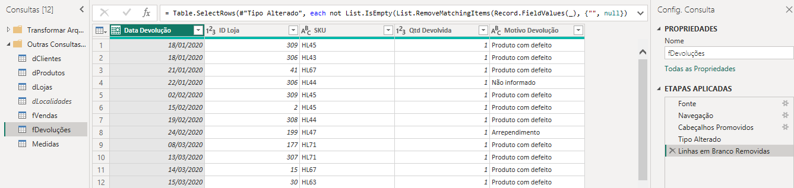
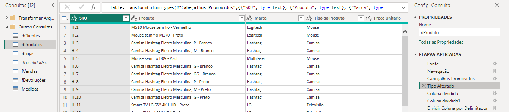
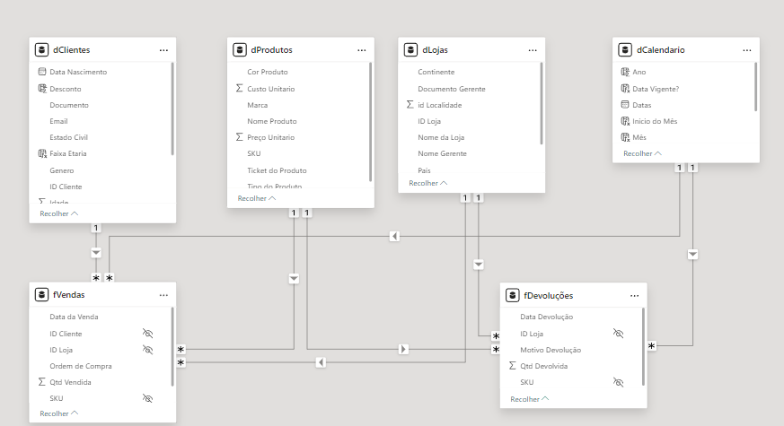
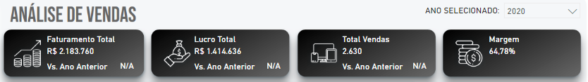
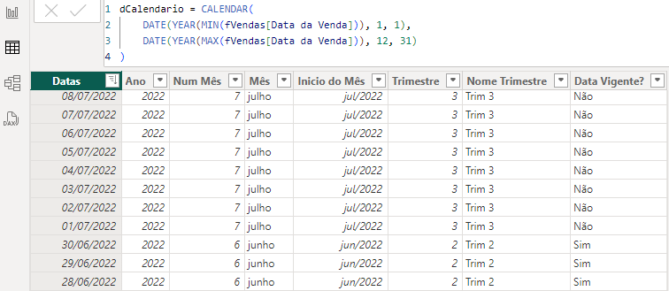
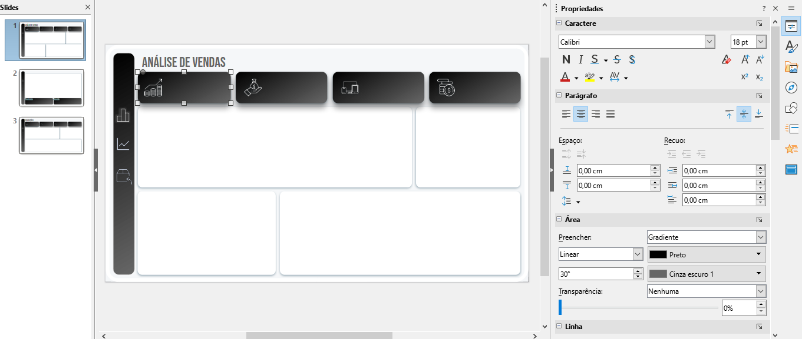
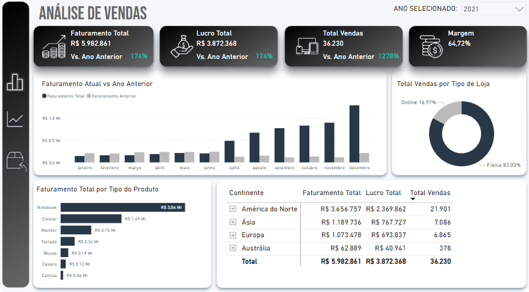
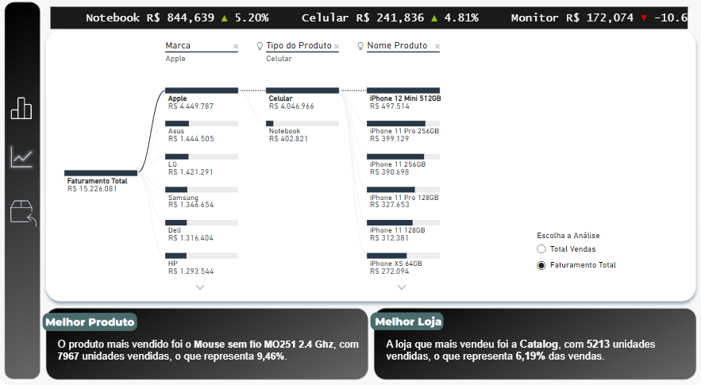
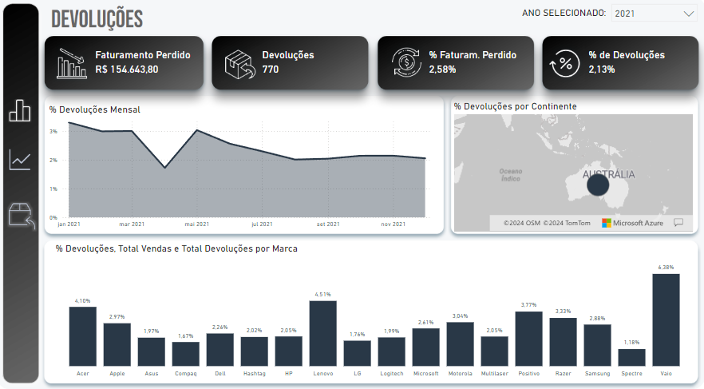

## Dashboard - Análise de Vendas no Power BI


Este projeto consiste na criação de um Dashboard de Vendas utilizando o Power BI, com o objetivo de fornecer insights valiosos e facilitar a tomada de decisões estratégicas através de uma análise visual e interativa. O dashboard será composto por três principais abas: Geral, Indicadores e Devoluções, cada uma abordando aspectos específicos das operações de vendas da empresa.

Acesse o dashboard completo [neste link](https://app.powerbi.com/view?r=eyJrIjoiNWQyY2JlYTMtOWQ4Mi00NTM5LWIxZDMtMGI5OGM2YTAzZDYwIiwidCI6IjE4ZTg1MjMyLTg4YWMtNDI2MC1iYTYzLTk3M2MzMTgxM2NmOSJ9)


### Dados Utilizados:

* `Base Devoluções`: Informações detalhadas sobre produtos devolvidos, incluindo motivos, datas e quantidades.
* `Base de Vendas (2020, 2021, 2022)`: Registros de todas as vendas realizadas nos anos de 2020, 2021 e 2022, permitindo uma análise temporal das tendências de vendas.
* `Cadastro de Clientes`: Dados dos clientes, incluindo informações demográficas e histórico de compras.
* `Cadastro de Localidades`: Informações geográficas das áreas de operação, ajudando a mapear as vendas por região.
* `Cadastro de Lojas`: Detalhes sobre as lojas físicas da empresa, incluindo localização, tamanho e desempenho.
* `Cadastro de Produtos`: Catálogo de produtos com descrições, categorias e preços.

### Estrutura do Dashboard:

**Aba Geral:**

* `Análise de Faturamento`: Visualização do faturamento total e comparação com o ano anterior.
* `Lucro`: Exibição do lucro total e comparação com o ano anterior.
* `Quantidade Vendida`: Quantidade de produtos vendidos e comparação com o ano anterior.
* `Margem`: Análise da margem de lucro.
* `Vendas por Tipo de Loja`: Comparação entre vendas em lojas físicas e online.
* `Faturamento por Produto`: Receita gerada por cada produto.
* `Receita, Lucro e Vendas por Continente/País`: Análise geográfica das vendas, lucro e receita.

---

**Aba Indicadores:**

* `Abertura de Vendas por Marca, Categoria e Produto`: Detalhamento das vendas por diferentes segmentos.
* `Análise de Melhor Produto e Melhor Loja`: Identificação dos produtos e lojas com melhor desempenho.
* `Comparativo Produto vs Mês Anterior`: Análise de desempenho dos produtos em relação ao mês anterior.

---

**Aba Devoluções:**

* `Faturamento Perdido`: Valor total de faturamento perdido devido a devoluções.
* `Quantidade Devolvida`: Quantidade total de produtos devolvidos.
* `% Faturamento Perdido`: Percentual do faturamento total perdido devido a devoluções.
* `% Devoluções`: Percentual de produtos devolvidos em relação ao total vendido.
* `% Devoluções Mensal`: Análise mensal das devoluções.
* `% Devoluções por Região`: Distribuição das devoluções por região geográfica.
* `% Devoluções por Fornecedor`: Análise das devoluções por fornecedor.
* `Filtrar por Categoria`: Opção de filtrar as devoluções por categoria de produto.

### Preparação dos Dados

Para a preparação dos dados, inicialmente realizei uma análise preliminar utilizando o Excel para explorar e entender as informações. Em seguida, utilizei o Power Query para conduzir o processo de ETL (Extração, Transformação e Carga), e apliquei DAX no Power BI para realizar uma análise exploratória. Este processo incluiu a limpeza, transformação, modelagem e carregamento dos dados, garantindo a integridade e a qualidade dos mesmos para a criação de insights precisos e relevantes.



Do autor: 
-  Etapa de transformação dos dados - Exclusão dos valores nulos

---



Do autor:
- Garante que cada coluna da tabela tenha o tipo de dado correto, o que ajuda na organização e análise dos dados.

---

Ademais, temos a tabela `dCalendario` que cobre o intervalo de datas desde o início do ano da menor data encontrada na coluna `Data da Venda` até o final do ano da maior data encontrada na mesma coluna.

```bash
dCalendario = CALENDAR(
    DATE(YEAR(MIN(fVendas[Data da Venda])), 1, 1),
    DATE(YEAR(MAX(fVendas[Data da Venda])), 12, 31)
)
```

--- 



Do autor:
- Relacionamento entre as tabelas.

### Análise Exploratória

Analisando as informações do `Faturamento Total`, `Lucro Total`, `Total Vendas`e `Margem`VS `Ano Anterior` foi encontrado um problema ao marcar **2020** na caixa interativa do dashboard de **Ano selecionado**.

**Sendo ele:**
- `Valor em branco`, pois o dataset que utilizei para análise não possui dados disponíveis para o ano de 2019, logo não é possível realizar uma comparação com o ano anterior.

Portanto, optei utilizar `N/A` tanto para quando não for selecionado **nenhum ano** tanto para **2020** , pois a comparação com o ano anterior não é aplicável.

Para tais questões, usaremos DAX para correção das informações.

```bash
VAR vcrescimento = 
    DIVIDE([Faturamento Total] - vfat_ano_anterior, vfat_ano_anterior)

RETURN
    IF(
        HASONEVALUE(dCalendario[Ano]) && NOT(ISBLANK(vcrescimento)),
        vcrescimento,
        "N/A"
    )
```



---

Em 2022 não tivemos um ano completo de vendas, logo é injusto comparar com 2021 que teve um ano completo. Para resolver esse problema foi necessário criar uma coluna chamada `Data Vigente`. Ele vai colocar **Sim** pra tudo que for data até última que é 30 de Junho de 2022 e **Não** para datas que ultrapassam e não estão presente na base dados.

Por fim, utilizei um filtro para analisar apenas as `Data Vigente` comparando o primeiro semestre de 2021 com o primeiro semestre de 2022.




### Desenvolvimento do projeto

`Algumas medidas utilizadas ao longo do projeto`

```bash
Faturamento LY = 
VAR vFayLY = 
    CALCULATE(
        [Faturamento Total],
        DATEADD(dCalendario[Datas], -1, YEAR)
    )
RETURN
    IF(
        HASONEVALUE(dCalendario[Ano]),
        vFayLY,
        BLANK()
    )
```

```bash
Lucro Total = 
SUMX(
    fVendas,
    (fVendas[Qtd Vendida] * RELATED(dProdutos[Preço Unitario]) * 0.9) - 
    (fVendas[Qtd Vendida] * RELATED(dProdutos[Custo Unitario]))
)
```

```bash
Produto Mais Vendido = 
VAR TopProduto =
    TOPN(
        1,
        ALL(dProdutos),
        [Total Vendas],
        DESC
    )
RETURN
    MAXX(
        TopProduto,
        dProdutos[Nome Produto]
    )
```

```bash
Qtd Vendida (Top 1 Produto) = 
CALCULATE(
    [Total Vendas],
    TOPN(
        1,
        ALL(dProdutos[Nome Produto]),
        [Total Vendas]
    )
)
```

```bash
% das Vendas (Top 1 Produto) = 
DIVIDE(
    [Qtd Vendida (Top 1 Produto)],
    [Total Vendas]
)
```

```bash
Lojas + Vendas = 
CALCULATE(
    MAX(dLojas[Nome da Loja]),
    TOPN(
        1,
        ALL(dLojas[Nome da Loja]),
        [Total Vendas]
    )
)
```

```bash
Qtd Vendida (Loja + Vendas) = 
CALCULATE(
    [Total Vendas],
    TOPN(
        1,
        ALL(dLojas[Nome da Loja]),
        [Total Vendas]
    )
)
```

```bash
% das Vendas (Loja + Vendas) = 
DIVIDE(
    [Qtd Vendida (Loja + Vendas)],
    [Total Vendas]
)
```
### Design

Após a criação das medidas, passei para a parte de criação dos visuais e storytelling.



---



---



---



Finalizado o dashboard, o mesmo foi analisado e validado quanto aos números, visuais e interatividade.Para implantação, utilizei o Power BI Desktop para publicação e realizei as demais configurações via Power BI Service.

### Insights

**Crescimento Consistente**

- De 2020 a 2022, houve um crescimento consistente em faturamento, lucro e volume de vendas.
- O faturamento cresceu de R$ 2.183.760 em 2020 para R$ 7.059.459 em 2022.
- O lucro cresceu de R$ 1.414.636 em 2020 para R$ 4.555.624 em 2022.
- O volume de vendas aumentou de 2.630 unidades em 2020 para 45.314 unidades em 2022.

**Diversificação de Produtos:**

- Houve uma diversificação significativa na linha de produtos. Enquanto celulares eram o principal produto em 2020, notebooks passaram a liderar em 2021 e 2022.

- Novos produtos como monitores, teclados, mouses, casacos e camisas foram introduzidos e contribuíram para o crescimento geral.

**Expansão Geográfica:**

- A expansão nas regiões da Ásia e Europa foi notável, com um crescimento substancial em faturamento e lucro.

- A América do Norte manteve sua posição de mercado dominante ao longo dos três anos.

**Oportunidades para Vendas Online:**

- Apesar do crescimento das vendas online, há um potencial significativo para expandir ainda mais este canal.

- A proporção de vendas online se manteve em torno de 16-17% ao longo dos anos.

**Estabilidade da Margem de Lucro:**

- A margem de lucro manteve-se relativamente estável, em torno de 64-65%, indicando uma boa gestão de custos e operações eficientes.

**Desempenho Sazonal:**

- Houve picos de faturamento nos meses finais do ano, possivelmente devido a promoções sazonais e eventos de compras, como a Black Friday.

### Conclusões

**Investimento em Marketing Digital:**

- Ampliar o foco nas vendas online com investimentos em marketing digital, otimização do site e melhorias na experiência do usuário.

**Continuidade na Diversificação de Produtos:**

- Continuar a diversificar a linha de produtos e monitorar o desempenho dos novos produtos para ajustar estratégias conforme necessário.

**Expansão Regional:**

- Focar em campanhas de marketing regionais e adaptações de produtos para atender às preferências locais, especialmente em mercados de alto potencial como a Ásia e a Europa.

**Promoções Sazonais:**

- Continuar a aproveitar eventos sazonais para impulsionar as vendas e desenvolver estratégias específicas para esses períodos, garantindo o estoque adequado e o suporte logístico.


